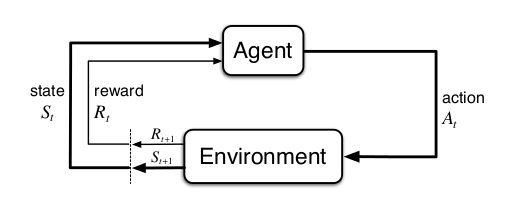

##Chapter 3
##Finite Markov Decision Processes

###3.1 The Agent-Environment Interface

Some definition:
- **Agent**: the learner and decision-maker
- **Environment**: things the *agent* interact with
- **Action**: the way the *agent* interact with its *environment*
- **Reward**: a special numerical values send by the *environment* to the *agent* that it tried to maximize

The agent interact with its environment at discrete time steps.
At each time step $$t$$ the agent receives some representation of the environment's *state*.

Let $$S_t \in \mathcal{S} A_t \in \mathcal{A(S_t)} R_{t+1} \in \mathcal{R} \subset \mathbb{R}$$ 

Where :
- $$\mathcal{S}$$ is the set of all possible states
- $$\mathcal{A(S_t)}$$ is the set of actions available in state S_t
- $$R_{t+1}$$ the reward associated to the previous action

At each time step, the agent implements a mapping from states to action.
This mapping is called a *policy*.
- $$\pi_t$$ is a policy at time step t
- $$\pi_t(a | s)$$ is the probability that $$A_t = a$$ if $$S_t = s$$

The framework is abstract and flexible so it can easily be extended to many reinforcement problems.

###3.2 Goals and Rewards

The reward is a simple number, $$R_t \in \mathbb{R}$$ passed from the environment to the agent.
The agent's goal is maximizing *cumulative* reward in the long run.
We can clearly state this informal idea as the *reward hypothesis*:

*That all of what we mean by goals and purposes can be well thought of as the maximization of the expected value of thecumulative sum of a received scalar signal (called reward).*

You must express your goal in terms of reward. Take care not to try to reward sub-goal.
For example in chess, your reward has to be :
- victory = +1
- draw = 0
- loss = -1

If you implement sub-goal by the means of capturing some pawn or something else,
your algorithm may try to achieve its sub-goal at the cost of its ultimate goal.

It is the environment which give the reward and not the agent itself.
We define the agent as everything we do not have full control over.
We can only interact with it with actions.
This does not preclude the agent from defining for itself a kind of internal reward
or a sequence of internal rewards.
Indeed, this is exactly what many reinforcement learning methods do.

###3.3 Returns

Let's defined our goal formally.
We want to maximize the *expected return*.
- Let $$G_t$$ a specific function of the reward sequence
- Let $$T$$ is a final time step

$$\begin{align}
G_t = R_{t+1} + R_{t+2} + R_{t+3} + ... + R_T
\end{align}$$

There is two kind of problems:
- episodic problems
  - there are episodes which ends in a special state called the *terminal state*
  - followed by a reset to a standard starting state.
- continiuing problems
  - the opposite of *episodic problems*
  - in this case the final step $$T = \infty$$

We will use an other mathematical definition of *returns* to simplify both problems

$$\begin{align}
G_t = R_{t+1} + \gamma R_{t+2} + \gamma^2 R_{t+3} + ... = \sum_{k=0}^{infty} \gamma^2 R_{t+k+1}

0 \leq \gamma \leq 1
\end{align}$$

$$\gamma$$ is called the *discount rate*.

The discrount rate determines the present value of future rewards.
The higher $$\gamma$$ is, the more strongly the objective takes futures rewards into account

###3.4 Unified Notation For Episodic and Continuing Tasks

To unified episodic both reinforcement learning task (episodic and continuing)
we will refer to a episodic state $$S_{t,i}$$ which is a state at time t in episode i
at $$S_t$$. We will almost always be considering a particular episode, or stating
stomething that is true for all episodes.

Also we need an other convention to unified both notation.
In continuing task we have a infinite sum. 
Considering episode termination to be the entering of a special *absorbing state*
that transition only to itself and generates only rewards of zero.

We can now define the return as :
$$\begin{align}
G_t = \sum_{k=0}^{T-t-1} \gamma^k R_{t+k+1}
\end{align}$$

including the possibility that $$T = \infty$$ or $$\gamma = 1$$ (but not both).

###3.5 The Markov Property

This chapter is about the state requirement to have certain properties and mainly the Markov one.
- *State*: information available by the agent

The state is more than just a sensation the agent has to be aware of.
It can be highly processed versions of original sensations, complex structures built up over time and more.

But the state signal should not be expected to inform the agent of everything about the environment or even everything that would be useful to it in making decision.
For example if the agent is playing blackjack, it should only be aware of the visibles data.o

A state signal that succeeds in retaining all relevant information is said to be **Markov**
or to have **the Markov property**.

To simplify our definition, we assume that there are a finite 
number of state and reward value so we can work in term of sum and probabilities rather
than integrals and probability densities but it can be easily extends.

Consider how a general environment might respond at time $$t+1$$ to the action taken at time $$t$$.
In the moste general, causal case this reponse may depend on everything that has happened earlier.
In this case the dynamics can be defined only by specifuing the complete probability distribution:

$$\begin{align}
P_r{R_{t+1} = r, S_{t+1} = s'| S_0, A_0, R_1, ..., S_{t-1}, A_{t-1}, R_t, S_t, A_t}
\end{align}$$

However, if the state has the *Markov Property*, we can simplify the equation:

$$\begin{align}
P_r{R_{t+1} = r, S_{t+1} = s'| S_t, A_t}
\end{align}$$

If an environment has the Markov property,
then its one-step dynamics enable us to predict the next state and expected next reward.
By iterating this equation, one can predict all future state and expected rewards fromknowledge only of the current state.
It also follows that Markov states provide the best possiblebasis for choosing actions.

Even when the state signal is non-Markov, it is still appropriate
to think of the state in reinforcement learning as an approximation to a Markov state.

The Markov property is important in reinforcement learning because
decision and values are assumed to be a function only of the current state.
Even if your case is not stricly Markov, the theory developped for 
the Markov case are still helpful to understand the behavior of the algorithms.

###3.6 Markov Decision Processes

*Markov decision process* or MDP: A reinforcement learning task that satisfies the Markov property.
If the state and action spaces are finite, then it is called a *finite MDP*.

A particulare finite MDP is defined by its state and action sets
and by the one-step dynamics of the environment. Given any state and action $$s$$ and $$a$$,
the probability of each possible pair of next state and reward, $$s', r$$ is denoted

$$\begin{align}
p(s', r|s, a) = P_r{S_{t+1} = s', R_{t+1} = r | S_t = s, A_t = a}
\end{align}$$

These quantitites completely specify the dynamics of a finite MDP.

Given the dynamics as specified, on can compute anything else one might want to know
about the environment, such as 

- the expected rewards for *state-action pairs*
$$\begin{align}
r(s, a) = \mathbb{E}[R_{t+1} | S_t = s, A_t = a] = \sum_{r \in \mathcal{R}} r \sum_{s' \in \mathcal{S}} p(s', r| s, a)
\end{align}$$

- the *state-transition probabilities*
$$\begin{align}
p(s'|s,a) = P_r{S_{t+1} = s' | S_t = s, A_t = a} = \sum_{r \in \mathcal{R}} p(s', r|s, a)
\end{align}$$

- the expcted rewards for *state-action-next-state triple*
$$\begin{align}
r(s,a,s') = \mathbb{E} [R_{t+1} | S_t = s, A_t = a, S_{t+1} = s'] = \frac{\sum_{r \in \mathcal{R}} rp(s', r| s, a)}{p(s'|s, a)}
\end{align}$$

