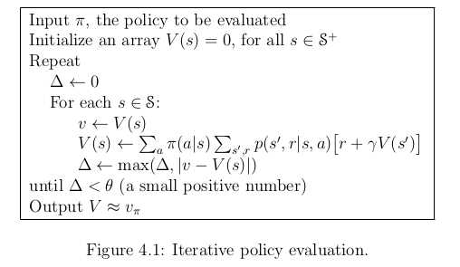
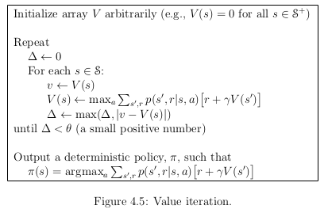
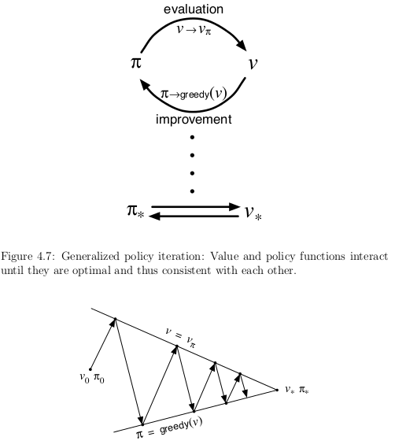

##Chapter 4
##Dynamique Programming

**Dynamique Programming**:
- it refers to a collection of algorithm that can be used to compute optimal policies
- it needs a perfect model of the environment (like a MDP)
- it has a great computation cost
- it has limited utility in reinforcement learning because of the cost and the model requirement
- it is important theoretically
- it is a base for many algorithm which aims at reproducing the effect of DP

They key idea of DP, and of reinforcement learning, is the use of value functions 
to organize and structure the search for good policies.

Let's rewrite the $$v_*$$ and $$q_*$$ which satisfy the Bellman optimality equations:
$$\begin{align}
v_*(s) &= \max_a \mathbb{E} [R_{t+1} + \gamma v_*(S_{t+1}) | S_t = s, A_t = a]\\
       &= \max_a \sum_{s', r} p(s', r | s, a) [r + \gamma v_*(s')]
\end{align}$$

or

$$\begin{align}
q_*(s,a) &= \mathbb{E} [R_{t+1} + \gamma \max_{a'} q_*(S_{t+1}) | S_t = s, A_t = a]\\
       &= \sum_{s', r} p(s', r | s, a) [r + \gamma \max_{a'} q_*(s')]
\end{align}$$

###4.1 Policy Evaluation

*Policy evaluation*:

$$\begin{align}
v_{\pi}(s) &= \mathbb{E}_{\pi} [ R_{t+1} + \gamma R_{t+2} + \gamma^2 R_{t+3} + \dotso | S_t = s ]\\
       &= \mathbb{E}_{\pi} [R_{t+1} + \gamma v_{\pi}(S_{t+1}) | S_t = s]\\
       &= \sum_a \pi(a|s) \sum_{s', r}p(s', r|s, a) [r + \gamma v_{\pi)(s')}]
\end{align}$$

- $$\pi(a|s)$$ is the probability of taking action $$a$$ in state $$s$$ under policy $$\pi$$o- The existence and uniqueness of $$v_{\pi}$$ are guaranteed as long as either $$\gamma < 1$$ or eventual termination is guaranteed from all states under the policy $$\pi$$

To find the solution to this equation we will do an iterative methods.
We can considere a sequence of appromixate $$v_0, v_1, v_2, \dotso$$
The initial value is chosen arbitrarily.
**Each successive approximation is obtained by using the Bellman equation vor $$v_{\pi}$$ as an update rule.**

$$\begin{align}
v_{k+1}(s) &= \max_a \mathbb{E} [R_{t+1} + \gamma v_k(S_{t+1}) | S_t = s, A_t = a]\\
       &= \max_a \sum_{s', r} p(s', r | s, a) [r + \gamma v_{k}(s')]
\end{align}$$

$$v_k = v_{\pi}$$ is a fixed point for this update rule.
This algorithm is called *iterative policy evaluation*.

$$k \rightarrow \infty \Rightarrow v_k \rightarrow v_{\pi}$$

- *full backup*
  - replace the value of the old state by a new value and this at each step
- *backup done in a sweep*
  - modifying the new vector directly without passing by a temporary vector

To stop the algorithm (since it converges in the limit) we test the quantity
$$\max_{s \in \mathcal{S}} |v_{k+1}(s) - v_k(s)|$$. When it is sufficiently small we stop the loop.

###4.2 Policy Improvement

Finding the value function of a policy is important, but maybe our policy isn't the 
best one and need some improvement.
For some state $$s$$ we would like to know whether or not we should change the policy.
To answer this problem is to consider selecting $$a$$ in $$s$$ and thereafter folloxing the existing policy $$\pi$$.

$$\begin{align}
q_{\pi}(s,a) &= \mathbb{E} [R_{t+1} + \gamma v_{\pi}(S_{t+1}) | S_t = s, A_t = a]\\
       &= \sum_{s', r} p(s', r | s, a) [r + \gamma v_{\pi}(s')]
\end{align}$$

If you have a better value, you have to change the policy to take the new action $$a$$ when
you are in the state $$s$$

If $$q_{\pi}(s, \pi'(s) \geq v_{\pi}(s)) \Rightarrow v_{\pi'} \geq v_{\pi}(s)$$

This is true for deterministic policies but it can be easily extended to stochastic policies.
In particular, the policy improvement theorem carries through as stated for the stochastic 
case, under the natural definition:

$$\begin{align}
q_{\pi} (s, \pi'(s)) = \sum_a \pi'(a|s) q_{\pi}(s,a)
\end{align}$$

in addition, if there are ties in policy improvement steps then in the stochastic case 
we need not select a single action from among them. Instead, each maximizing action can 
be given a portion of the probability of being selected in the new greedy policy.

###4.3 Policy Iteration

The goal is to improve $$\pi$$ using $$v_{\pi}$$, once we get $$\pi'$$ we can do it again.

$${\pi}_0 \xrightarrow{\mathbb{E}} v_{\pi_0} \xrightarrow{\mathbb{I}} \pi_1 \xrightarrow{\mathbb{E}} \dotso \xrightarrow{\mathbb{I}} \pi_* \xrightarrow{\mathbb{E}} v_*$$

Each policy is guaranteed to be a strict improvement over the previous one.

If you are using a finite MDP, this process must converge to an optimal policy.

This algorithm is a way of finding a optimal policy is called *policy iteration*.
It is worth noting that the *policy iteration* increases greatly the speed of policy evaluation.
Usually, policy iteration converges in few iterations.

###4.4 Value Iteration

One drawback to policy iteration is that each of its iterations involves policy evaluation.
The computation cost might be high.
We must be able to truncate the useless iteration (when we get a policy as efficient as the optimal one).

- *value iteration*
  - special case when policy evaluation is stopped after one sweep
  - It can be written as a particularly simple backup operation that combines the policy improvement and truncated policy evaluation steps

$$\begin{align}
v_{k+1}(s) &= \max_a \mathbb{E} [R_{t+1} + \gamma v_k(S_{t+1}) | S_t = s, A_t = a]\\
           &= \max_a \sum_{s',r}p(s',r|s,a) [r+ \gamma v_k(s')]
\end{align}$$

Value iteration is obtained simply by turning the Bellman optimality equation into a update rule.
The value iteration backup is identical to the policy evaluation backup except that it 
requires the maximum to be taken over all actions.

Value iteration effectively combines, in each of its sweeps, one sweep of policy evaluation and one sweep of policy improvement.
Often, it can converge faster interposing multiple policy evaluation sweeps between each policy improvement sweep.
All of these algorithms converge to an optimal policy for discounted finite MDPs.

###4.5 Asynchronous Dynamic Programming

DP methods that we discussed so far involve operations over the entire state set of the MDP.
It is troublesome because if we possess a large state, the computation cost may be too big.
For example the game of backgammon has over $$10^{20}$$ states.

Then we will introduce *asynchronous* DP algorithms.
- they back up the values of states in any order
- they are using whatever values of other states happen to be available
- The values of some states may be backed up several times before the values of others are backed up once
- to converge correctly, it must continue to backup the values of all states
  - it can't ignore any state after some point in the computation
- they allow great flexibility in selecting states to which backup operations are applied

Avoiding sweeps does not necessarily mean that we can get away with less computation.
It just means that an algorithm does not need to get locked into any hopelessly long 
sweep before it can make progress improving a policy.
We can adapt our backup plan so we can focus on doing iteration on state will matter.
Some state does not need to be backup as often as other and some state may even don't need 
to be backup at all depending of our optimal behavior.

Asynchronous algorithms:
- make it isier to mix computation with real-time interaction
  - We can run an iterative DP algorithm at the same time that a agent is experiencing the MDP
  - The agent experience can help to know on which state we apply a DP algorithm
  - the latest value and policy information (from the DP algorithm) can guide the agent's decision-makin

For example, we can apply backups to states as the agent visits them. This makes it 
possible to focus the DP algorithm's backup onto parts of the state set that are most
relevent to the agent.

###4.6 Generalized Policy Iteration

- Policy evaluation
  - making the value function consistent with the current policy
- Policy improvement
  - making the policy greedy with respect to the current value function

- *Generalized policy iteration* (GPI)
  - refer to the general idea of letting policy evaluation and policy improvement processes interact, independent of the granularity and other details of the two processes.
  - The evaluation and improvement processes can be viewed as both competing and cooperating
    - they compete because they pull in opposing directions
    - Making the policy greedy with respect to the value function makes the value function incorrect for the changed policy
    - making the value function consistent with the policy cause that policy no longer to be greedy
  - In the long run, these two processes interact to find a single joint solution
    - the optimal value function and an optimal policy

The two processes together achieve the overall goal of optimality even though neither is 
attempting to achieve it directly.

###4.7 Efficiency of Dynamic Programming

- Dynamic Programming may seems not practical for very large problem
  - but compared with other methods for solving MDPs, it is quite efficient
  - the time DP methods take to find an optimal policy is polynomial (in the number of state and actions)
  - DP methods is guaranteed to find an optimal policy in polynomial time
  - Linear programming methods can also be used, but became inefficient as the state grows large.

DP is sometimes thought to be of limited applicability because of the fact that the number of states often grows exponentially with the number of state variables.
In practice, DP methods canbe used with today's computer to solves MDPs with millions of states.

On large state space, asynchronous DP methods are often prefered.
Synchronous methods require to compute state which may be irrelevant.
Asynchronous methods can help by only apply DP methods on the state you want.
You may find good or optimal policies much faster than suncrhonous methods can
