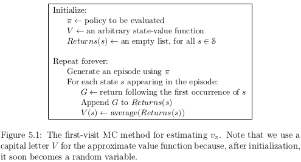
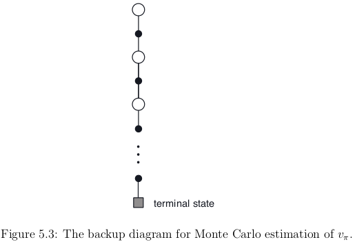

##Chapter 5
##Monte Carlo Methods

The characteristics of *Monte Carlo Methods* is :
- We do not assume complete knowledge of the environment
  - in fact, we only need experience (sample data)
  - even if we have no prior knowledge of the environment dynamics, we can still attain optimal behavior
- A model is needed
  - but only the generate sample transitions are mandatory
  - not the complete probability distributions of all possible transition
    - which is require in DP
- It is a way of solving RL problème based on averaging sample returns
- We assume we are on episodic tasks
  - it means experience is divided into episodes

To make a parallel to the work done previously, monte-carlo methods behave like the bandit 
methods but each state is now a bandit problem in which each bandit problems are 
interrelated.

Monte Carlo Methods use methods we saw in previous chapter (policy evaluation ...)

###5.1 Monte Carlo Prediction

*value function* : expected return (cumulative future reward) starting from that state.

The idea underlies MC methods is to estimate a value function by experience by averaging 
the returns observed after visits to that state.

Suppose we wish to estimate $$v_{\pi}(s)$$, the value of a state $$s$$ under policy $$\pi$$.
- *visit* is an occurence of state $$s$$ in an episode
- $$s$$ may be visited multiple times in the same episode
  - *first visite* to $$s$$ is the first time it is visited in an episode
- The *first-vist MC method*
  - it estimates $$v_{\pi}$$ as the average of the returns following first visits to $$s$$
- The *every-visit MC method*
  - is the average of the returns following all visits to $$s$$
- Both methods converge to $$v_{\pi}$$ as the number of visits (or first visits) to $$s$$ goes to infinity

For DP methods, you must have complete knowledge of the environment and sometime it is hard
to find some quantities needed for computation (like $$p(s',r|s,a)$$).
In some game (like black jack for exemple), it is really hard to determine thoses quantities.
MC methods does not have this issue because we are working with sample.
Generating the sample you will work with is often easier than to determine the one needed for
DP.

Backup diagrams are pertinent and we can generalize the idea to MC algorithms.
- backup diagram idea is
  - to show at the top *the root node* to be updated
  - to show below all the transitions and leaf nodes whose rewards and estimated values contribute to the update
- In MC estimation of $$v_{\pi}$$
  - the root is a state node
  - below is the entire trajectory of transitions along a particular single episode
    - ending at the terminal state

- Difference between DP diagram (Figure 3.4) and MC diagram (Figure 5.3)
  - DP diagram shows all possible transitions
  - DP diagram shows only one-step transitions
  - MC diagram shows only those sampled on the one episode
  - MC diagram goes all the way to the end of the episode

- each estimation for each state are independant in MC methods
- MC methods do not *bootstrap*
- the computational expense of estimating the value of a single state is independent of the number of states
  - this can be attractive when one requires the value of only one subset of states
  - one can generate many sample episodes starting from the states of interest
    - averaging returns from only tese states ignoring all others

###5.2 Monte Carlo Estimation of Action Values

If a model is not available
- value functions is not enough to determine a policy
- we have to estimate *action values*

Let's consider the policy evaluation problem for action values.
- $$q_{\pi}(s,a)$$ is the exepected return when
  - starting in state $$s$$
  - taking action $$a$$
  - following policy $$\pi$$
- MC methods for this are almost the same as the one presented for state values
  - except we talk about visits to a state-action pair
- a state-action $$(s,a)$$ pair is visited 
  - if a state $$s$$ is visited and an action $$a$$ is taken in it
- The *every-vist* MC methods and *first-visit* MC method have the same behavior
  - but instead of state, it is a state-action pair
  - they converge quadratically (as before) to the true expected values

The only complication is that many state-action pairs may never be visited.
$$\pi$$ must be a non-deterministic because otherwise we will only observe return for one of the action from each state.
To compare alternatives, we need to estimate the value of *all* the actions from each state.

This is the general problem of *maintaining exploration*.
- For policy evaluation to work for action values, we must assure continual exploration
  - one solution is 
    - start in a *stat-action pair*
    - every pair has a nonzero probability of bein selected as the start
    - this guarantees that all stat-action pair will be visited an infinite number of times
    - we call this **the assumption of exploring starts**

- The assumption of exploring starts can be useful
- but cannot be relied upon in general
  - particularly when learning directly from actual interaction with an environment

Another solution is to consider only stochastic policy.
It means all state-action paris can be encoutered with a nonzero probability.

###5.3 Monte Carlo Control
