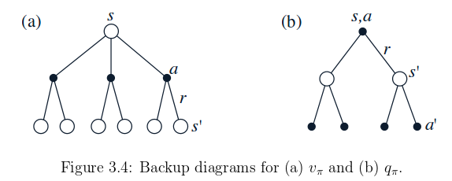

###3.7 Value Functions

Reinforcement learning algorithms involve estimating **value functions** that estimate *how*
good it is for the agent to be in a given state.
The *how good* notion is defined in terms of future rewards (or return) that can be expected.

Let $$v_{\pi}(s)$$ the *value* of a state $$s$$ under a policy $$\pi$$.
It is the expected return when starting in $$s$$ and following $$\pi$$ thereafter.
For MDPs, we can define it formally as:

$$\begin{align}
v_{\pi}(s) = \mathbb{E}_{\pi} [G_t| S_t = s] = \mathbb{E}_{\pi} \left[\sum_{k=0}^{\infty} \gamma^k R_{t+k+1} | S_t = s \right]
\end{align}$$

where $$\mathbb{E}_{\pi}[.]$$ denotes the expected value of a random variable
given that the agent follows policy $$\pi$$, and t is any time step.
We call the function $$v_{\pi}$$ the *state-value function for policy* $$\pi$$.

Similarly, we define the value of taking action $$a$$ in state $$s$$ under a policy $$\pi$$
denoted $$q_{\pi}(s, a)$$ as the expected return starting from $$s$$, taking the action
$$a$$, and thereafter following policy $$\pi$$:

$$\begin{align}
q_{\pi}(s,a) = \mathbb{E}_{\pi} [G_t| S_t = s, A_t = a] = \mathbb{E}_{\pi} \left[\sum_{k=0}^{\infty} \gamma^k R_{t+k+1} | S_t = s, A_t = a \right]
\end{align}$$

We call the function $$q_{\pi}$$ the *action-value function for policy* $$\pi$$

Theses function can be estimated from experience, by exploration.
We call estimation methods of this kind *Monte Carlo methods* because they involve
averaging over many random samples of actual returns.
If there are very many states, then it may not be practical to keep separate averages for each state individually.
Instead, the agent would have to maintain $$v_{\pi}$$ and $$q_{\pi}$$ as parameterized
functions and adjust the parameters to better match the observed returns.

A fundamental property of value functions used throughout reinforcement learning and
dynamic programming is thath they satisfy particular recursive relationship.

$$\begin{align}
v_{\pi}(s) &= \mathbb{E}_{\pi} [G_t| S_t = s]\\
           &= \mathbb{E}_{\pi} \left[ \sum_{k=0}^{\infty} \gamma^k R_{t+k+1} | S_t = s \right]\\
           &= \mathbb{E}_{\pi} \left[ R_{t+1} + \gamma \sum_{k=0}^{\infty} \gamma^k R_{t+k+2} | S_t = s \right]\\
           &= \dotsi\\
           &= \sum_{a} \pi(a|s) \sum_{s', r} p(s', r|s, a) [r + \gamma v_{\pi}(s')]
\end{align}$$

This equation is the *Bellman equation for* $$v_{\pi}$$.
It expresses a relationship between the value of a state and the values of its successor
states.

Think of looking ahead from one state to its possible successor states.
Starting from state s, the agent could take any of some set of actions.
From each of these, the environment could respond with one of several next states $$s'$$
along with a reward $$r$$.
The Bellman equation averages over all the possibilities, weighting each by its probability
of occurring.

The value function $$v_{\pi}$$ is the unique solution to it's Bellman equation.
We show in subsequent chapters how this Bellman equation forms the basis of a number of ways
to compute, approximate, and learn $$v_{\pi}$$.
