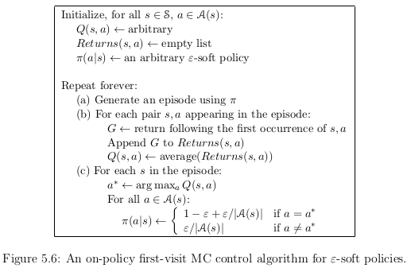

###5.4 Monte Carlo Control without Exploring Starts

To avoid the assumption of exploring starts there are two approches:
- *on-policy* methods
  - attempt to evaluate or improve the policy that is used to make decision
- *off-policy* methods
  - evaluate or improve an other policy that is used to generate the data

The Monte Carlo ES methods is a on-policy method.

*Soft* policy (in on-policy control methods) means
- $$\pi(a|s) > 0$$ for all $$s \in \mathcal{S}$$ and all $$a \in \mathcal{A}(s)$$
- but gradually shifted closer to a deterministic optimal policy
- $$\Epsilon$$-greedy policies are an example of *soft*-policies

The overall idea of on-policy MC control is still that of GPI.
Since we cannot use exploring starts, we need to find an other policy which will make us
explore all states.
Fortunately, GPI does not require the policy to be greedy, 
but to move toward a greedy policy.
We will then fix $$\pi$$ to an $$\Epsilon$$-soft policy.
- We adjust the policy with a random probability
- just like is $$\Epsilon$$-greedy is for greedy policy

To improve $$\Epsilon$$-soft
- Let's consider a new environment which behaves like the original one
  - except with the requirement that policies be $$\Epsilon$$-soft "moved inside" the environment.
- In each state, you have the probability $$1-\Epsilon$$ to behave in the new environment exactly like the old one.
- You have a probability $$\Epsilon$$ to take a random action and then act like the old environement.

- $$\tilde{v_*}$$ and $$\tilde{q_*}$$ denote the optimal value functions for the new environment.
- $$\pi$$ is optimal among $$\Epsilon$$-soft policies if and only if $$v_{\pi} = \tilde{v_*}$$

$$\begin{align}
\tilde{v_*}(s) &= (1 - \Epsilon) \max_a \tilde{q_*}(s,a) + \frac{\epsilon}{|\mathcal{A(s)}|} \sum_{a} \tilde{q_*}(s,a)\\
             &= (1 - \Epsilon) \max_a \sum_{s',r} p(s',r|s,a) [r + \gamma \tilde{v_*}(s')] + \frac{\epsilon}{|\mathcal{A(s)}|} \sum_a \sum_{s',r} p(s',r | s,a) [ r + \gamma \tilde{v_*}(s')]
\end{align}$$

When equality holds and the $$\Epsilon$$-soft policy $$\pi$$is not longer improved, 
then we also know that

$$\begin{align}
v_{\pi}(s) &= (1 - \Epsilon) \max_a q_{\pi}(s,a) + \frac{\epsilon}{|\mathcal{A(s)}|} \sum_{a} q_{\pi}(s,a)\\
             &= (1 - \Epsilon) \max_a \sum_{s',r} p(s',r|s,a) [r + \gamma v_{\pi}(s')] + \frac{\epsilon}{|\mathcal{A(s)}|} \sum_a \sum_{s',r} p(s',r | s,a) [ r + \gamma v_{\pi}(s')]
\end{align}$$

Those equations are the same except we change $$\tilde{v_*}$$ by $$v_{\pi}$$.
Since $$\tilde{v_*}$$ is the unique solution, it must be that $$v_{\pi} = \tilde{v_*$$}$$.

Now we can eliminate the assumption of exploring starts since we proved that policy iteration
work for $$\Epsilon$$-soft policies.

